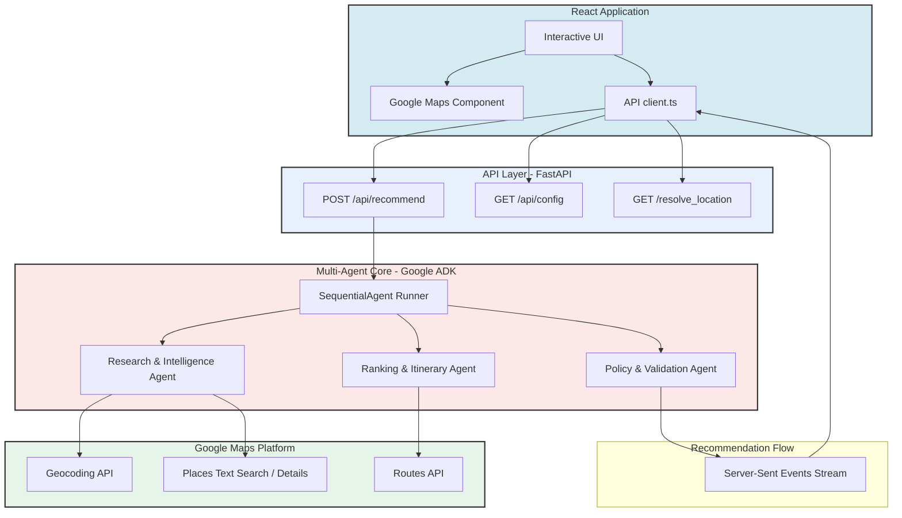
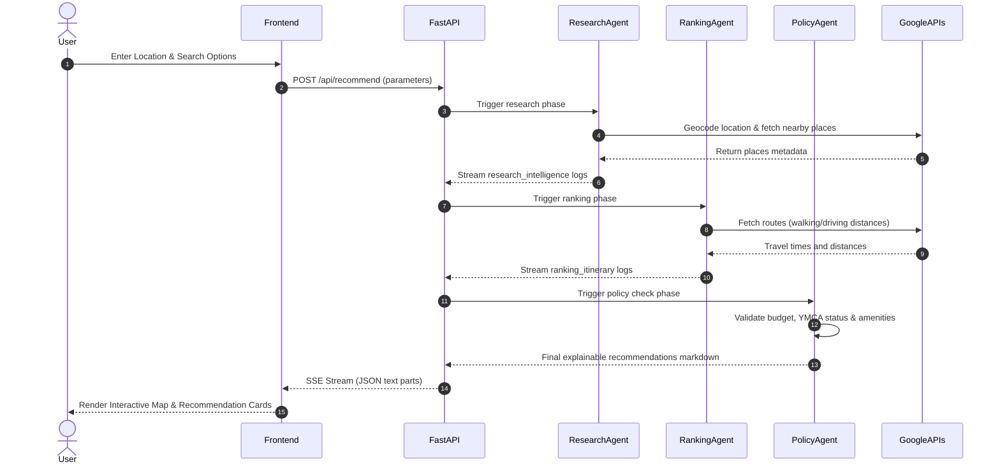

# TravelWell AI

### *An Explainable Multi-Agent AI Concierge for Finding the Perfect Workout While Traveling*

[](https://www.python.org/)
[](https://react.dev/)
[](https://github.com/google/adk)
[](https://cloud.google.com/run)
[](https://cloud.google.com/vertex-ai)
[](https://developers.google.com/maps)
[](LICENSE)

---

## 🌟 Overview

TravelWell AI helps travelers discover fitness facilities that match their memberships, budget, schedule, and workout preferences.

Unlike traditional search, TravelWell uses an **explainable multi-agent architecture** that researches, validates, and ranks recommendations before presenting them to the user.

### Key Highlights
*   **Explainable AI:** Every recommendation features a human-readable validation summary explaining why the gym fits or fails constraints.
*   **Multi-Agent Orchestration:** Sequentially routes queries through three specialized agents: Research, Ranking, and Policy Validation.
*   **Deterministic Validation:** Compares live API data against hard user requirements to detect contradictions.
*   **Google Maps & Places Integration:** Features live geocoding landmark fallbacks, interactive markers, and distance calculations.
*   **Demo / Fallback Mode:** Automatically drops back to high-quality local mock datasets if Google Maps or Vertex AI services are temporarily throttled or unavailable.

---

## ✨ Features

*   **✓ Multi-Agent AI Concierge:** Orchestrated by the Google ADK Sequential Agent runner.
*   **✓ Google Maps:** Interactive map rendering with synced custom user and gym location pins.
*   **✓ Google Places Search:** Deep location searches querying nearby facilities with live API calls.
*   **✓ Intelligent Location Resolution:** Resolves landmarks (e.g., "Willis Tower", "McCormick Place") automatically via geocoding and text-search fallbacks.
*   **✓ YMCA Reciprocity Validation:** Detects YMCA memberships and automatically marks eligible reciprocity clubs as free ($0.00 / guest pass).
*   **✓ Budget-aware Recommendations:** Validates day pass prices against user budgets.
*   **✓ Explainable Validation:** Detailed checks for amenities (showers, pools, treadmills), opening hours, and travel time.
*   **✓ Interactive Map & Sync:** Clicking a map marker selects and scrolls to the gym's recommendation card.
*   **✓ AI Concierge Timeline:** Real-time visual progress tracker showing the current reasoning stage of the multi-agent pipeline.
*   **✓ Demo Fallback Mode:** Gracefully shifts to static data with clear developer warning banners if external services fail.

---

## 🏗️ Architecture



*For a detailed breakdown of components, sequence diagrams, and deployments, see [ARCHITECTURE.md](docs/ARCHITECTURE.md).*

---

## 🔄 Agent Workflow



---

## 🤖 Agent Responsibilities

### 🔎 Research & Intelligence Agent
*   **Resolve Locations:** Geocodes text inputs (neighborhoods, cities, or landmark names) to coordinates.
*   **Discover Facilities:** Searches Google Places for gyms, recreation centers, and fitness spots.
*   **Collect Metadata:** Extracts operational details, phone numbers, ratings, websites, and opening times.
*   **Preserve Uncertainty:** Retains missing attributes as "unknown" to prevent hallucinations.

### 📊 Ranking & Itinerary Agent
*   **Compare Facilities:** Ranks gyms based on proximity to the user's starting point.
*   **Estimate Travel Time:** Queries Google Routes API to get walking and driving durations.
*   **Create Rankings:** Computes travel times and ranks results.
*   **Summarize Itinerary:** Provides clear transit warnings if walking is too long.

### ⚖️ Policy & Validation Agent
*   **Enforce Memberships:** Checks if the user's YMCA membership waives guest pass costs.
*   **Validate Budget:** Detects if guest passes exceed budget constraints.
*   **Verify Amenities:** Double-checks amenity parameters (e.g. pools, treadmills, showers).
*   **Detect Contradictions:** Ensures logic remains consistent (e.g. flagging premium gyms if budget is free).
*   **Compute Confidence:** Labels recommendations as *Excellent Match*, *Good Alternative*, or *Limited Match*.
*   **Explain Recommendations:** Writes clear bullet points summarizing why each gym is recommended or marked as alternative.

---

## 💻 Technology Stack

### Frontend
*   **React (Vite):** Core client-side interface framework.
*   **TypeScript:** Type-safe components and interface definitions.
*   **Google Maps JavaScript API:** Interactive map rendering.

### Backend
*   **FastAPI:** High-performance REST & SSE stream API wrapper.
*   **Google ADK (Agent Development Kit):** Multi-agent orchestrator and Sequential Agent runner.
*   **Vertex AI (Gemini):** Core LLM engine driving multi-agent reasoning.
*   **Python:** Backend runtime engine.

### Cloud & Google APIs
*   **Google Cloud Run:** Fully managed serverless deployments.
*   **Google Artifact Registry:** Secure container registry.
*   **Google Places API:** Live fitness facility searches.
*   **Google Geocoding API:** Location resolving.
*   **Google Routes API:** Travel time calculations.

---

## 🚀 Deployment & Installation

### Local Development

1.  **Clone the Repository:**
    ```bash
    git clone https://github.com/obscrivn/travelwell-ai.git
    cd travelwell-ai
    ```

2.  **Run the Backend (Python):**
    ```bash
    cd backend
    python -m venv .venv
    source .venv/bin/activate
    pip install -e .
    # Create .env with Vertex AI / Google Maps details
    # Ex: GOOGLE_MAPS_API_KEY=your_key
    # Ex: GOOGLE_GENAI_USE_VERTEXAI=true
    uvicorn app.fast_api_app:app --host 127.0.0.1 --port 8000
    ```

3.  **Run the Frontend (React):**
    ```bash
    cd ../frontend
    npm install
    # Create public/config.json pointing to your local backend
    # Ex: {"VITE_API_BASE_URL": "http://localhost:8000"}
    npm run dev
    ```

### Cloud Run Deployment

The project is built to run containerized in Google Cloud:
*   **Backend:** Packaged via Docker and deployed to Cloud Run with environment variables for API keys and project settings.
*   **Frontend:** Built static and served via Nginx on Cloud Run.

### Environment Variables
*   `GOOGLE_MAPS_API_KEY`: API credential for Google Places, Routes, and Geocoding APIs.
*   `USE_MOCK_DATA`: Set to `true` to force mock fallback mode (bypasses Maps & Places API requests for demo purposes).
*   `GOOGLE_GENAI_USE_VERTEXAI`: Set to `true` to use Google Vertex AI model endpoints.

---

## 🖼️ Screenshots

*Placeholders for application visuals:*

| Dashboard | Interactive Map |
|---|---|
|  |  |

| Recommendation Cards | AI Concierge Timeline |
|---|---|
|  |  |

---

## 🗺️ Roadmap

*   **Real-Time Occupancy Tracking:** Detect busy gym hours dynamically.
*   **Apple Health / Google Fit Integration:** Import personal workout preferences automatically.
*   **Hotel Integrations:** Find gyms offering partnerships with the user's hotel.
*   **Voice Concierge:** Interact with the TravelWell agent using speech.
*   **Itinerary Optimization:** Create multi-stop travel fitness schedules.

---

## ⚖️ Why TravelWell AI?

| Traditional Fitness Search | TravelWell AI |
|---|---|
| ❌ Plain keyword matching | **✓ Multi-agent semantic reasoning** |
| ❌ Manual comparison of multiple sites | **✓ Deterministic policy check constraints** |
| ❌ No pricing or reciprocity checks | **✓ Automatic YMCA reciprocity & budget checks** |
| ❌ Static text reviews | **✓ Explainable match scoring validation** |

---

## 📄 License

This project is licensed under the MIT License - see the LICENSE file for details.
